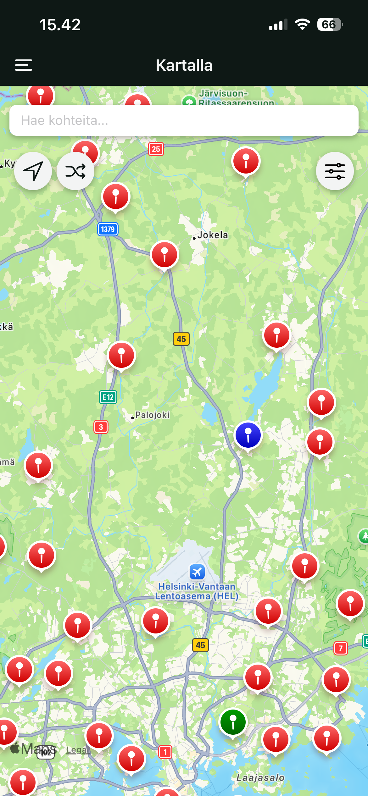
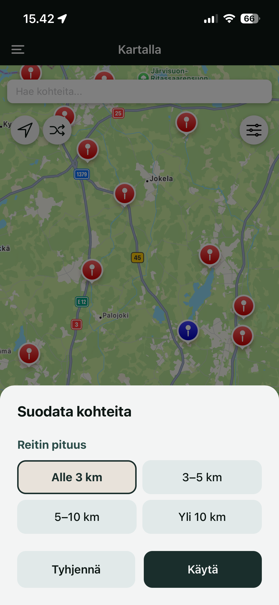

# Description

Kartalla is a mobile application that helps users discover nature destinations and national parks. The users can comment the destinations and add favourites. In the future, the app may also include features such as displaying weather conditions at the destination. The app is a student project in Software development project II coure in Haaga-Helia university of applied sciences.

The app is built with React Native and Expo, database is implemented with SQLite/Firebase and the code is written in TypeScript. We're aiming to publish the app in app stores.

Some screenshots of the application at the moment:





## Installation

### Prerequisites
- [Node.js](https://nodejs.org/)
- [npm](https://www.npmjs.com/)
- [Expo Go](https://expo.dev/client) app installed on your iOS or Android device

### Clone the repository
git clone https://github.com/Ohjelmistoprojekti-2-tiimi-Kartalla/Kartalla-App.git
```sh
$ cd Kartalla-App
```
### Install dependencies
```sh
$ npm install
```

### Start the server
```sh
$ npx expo start
```

If needed, install ngrok: 
```sh
$ npm i -g @expo/ngrokuse 
```
and use command
```sh
 $ npx expo start --tunnel
```
Get API key Firebase Firestore Database
"https://firebase.google.com/"
```sh
 "Make rules to FireStorage Database
 service cloud.firestore {
  match /databases/{database}/documents {
    match /{document=**} {
      allow read, write: if true;
    }
  }
}"
"properly configure rules and secure data before deploying app!"
"add .env file FIREBASE_API_KEY='ENTER YOUR API'"
```

Android Users get googlemaps API key
"https://developers.google.com/maps"
```sh
"Enamble Maps JavaScript API"
"add .env file GOOGLEPLATFORM_API_KEY='ENTER YOUR API'"
```
For Google places 
"https://developers.google.com/maps"
```sh
"Enamble Places API"
"add .env file GOOGLEPLATFORM_API_KEY=[ API KEY HERE ]"
```
### Open the app:
Scan the QR code in your terminal to open the Expo Go app on your phone

## Team members
- [Risto Haime](https://github.com/ristohaime)
- [Niko Kaarmila](https://github.com/nikokaar)
- [Heli Kulomaa](https://github.com/helikulomaa)
- [Daniel Nieminen](https://github.com/denwell76) 
- [Matias Nisonen](https://github.com/matumatatu)


## Backlog
[View backlog](https://github.com/orgs/Ohjelmistoprojekti-2-tiimi-Kartalla/projects/1)

## UI plans
[Wireframing](https://app.mockflow.com/view/MMdWbseTci#/page/6c5db0ebd0b847ff9448d5881e652755/mode/view)

## Licencing

The repository is licenced by [MIT licence.](https://github.com/Ohjelmistoprojekti-2-tiimi-Kartalla/Kartalla-App/blob/main/LICENCE.txt)
