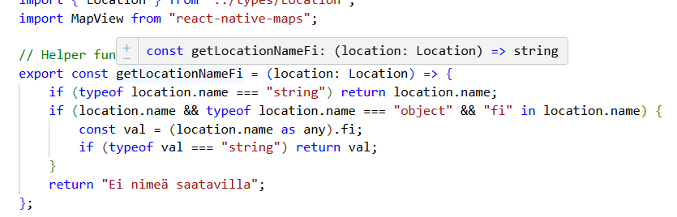
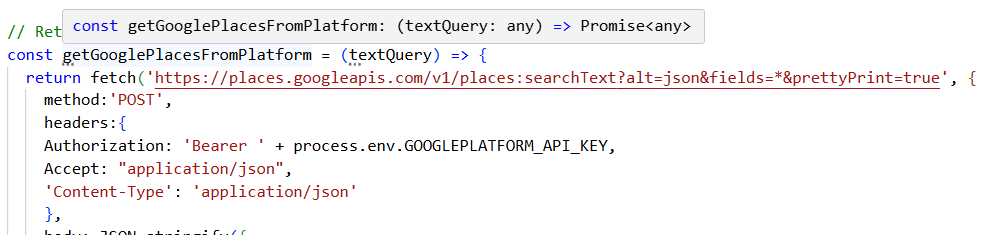

# Seminaarityö: Hyviä käytäntöjä TypeScriptin käyttöön React Native -projektissa

Tässä Ohjelmistokehityksen teknologioita -kurssin seminaari tehtävässä kehitän Ohjelmistoprojekti 2 -kurssilla tehtävää projektia ja kirjoitan samalla itselleni opasta hyvistä käytänteistä TypeSriptin käytössä.

## Tavoitteet

- Parantaa projektin koodin laatua ja luotettavuutta hyödyntämällä TypeScriptin ominaisuuksia entistä paremmin.
- Yhdenmukaistaa TypeScriptin käyttöä projektissa
- Kirkastaa itselle, mitkä ovat suositeltuja tapoja TypeScriptin yhteydessä ja miksi mitäkin tapaa käytetään

## Lähtötilanne ja projektin kuvaus

Lähtökohtana on Ohjelmistoprojekti 2 -kurssilla tehty luontokohteita hakeva Kartalla-sovellus, jota on kehitetty 5 hengen tiimissä muutaman kuukauden ajan. Kyseessä on React Nativella kehitetty mobiilisovellus, jossa on jo käytetty TypeScriptiä, mutta sen käyttöä voisi yhdenmukaistaa ja parantaa. 

## Tyyppinen määrittely yhdenmukaisesti ja riittävällä tarkkuudella

### Milloin tyyppi kannattaa määritellä eksplisiittisesti?

TypeScript päättelee useimmiten muuttujien, tilojen ja funktioiden paluuarvojen tyypit, joten tyyppiä ei useinkaan tarvitsisi määritellä eksplisiittisesti. Milloin sitten tyyppi pitää määritellä ja milloin TypeScript päättelee sen? Vastaus tähän kysymykseen riippuu lähteestä, eikä siihen näytä olevan yksiselitteistä ohjetta. Olennaisinta lienee, että toimii projektin sisällä yhdenmukaisesti.

#### TypeScriptin päättely riittää (Type inference)

TypeScript päättelee tyypin automaattisesti tapauksissa, jossa muuttujalle annetaan alustusarvo tai kun tyyppi tulee ilmi kontekstista. Esimerkiksi TypeScript päättelee useimmiten funktion paluuarvon tyypin return-lausekkeessa olevasta tyypistä eikä sitä tarvitse kirjoittaa itse.

Vaikka TypeScript päättelee tyypin monessa kohtaa automaattisesi, sen voi varmuuden vuoksi määritellä eksplisiittisesti myös niissä tapauksissa. Tällaisia vapaaehtoisia kohtia ovat esimerkiksi fuktion paluuarvot tai tilojen tyypit. Määrittelin kaikki projektin tilojen tyypit eksplisiittisesti (Commit d7366a3, 
 "Define strict typing for states").

Tilan tyypin määrittely:

esim. 

```
const [mapReady, setMapReady] = useState(false);
```
```
const [mapReady, setMapReady] = useState<boolean>(false);
```
#### Eksplisiittinen määrittely (Explicit types)

Tyypit kannattaa määritellä eksplisiittiseti  funktioiden parametreille, objekteille ja sovelluksen osille, jotka ovat koko sovelluksen toiminnan kannalta kannalta erityisen kriittisiä. Tällaisiä kriittisiä osia ovat esimerkiksi API-vastaukset (esim. projektissa tyyppi Location on tällainen). Kun TypeScrip ei pysty päättelemään tyyppiä, se antaa sille tyypiksi any. Any-tyyppiä olisi hyvä välttää aina kun mahdollista.

Tarkastin kaikista projektin funktioista määrittyykö niiden paluuarvot automaattisesti ja jätin määrittelemättä explisiittisesti ne funktiot, joissa TypeScript osaa määritellä paluuarvon. Paluuarvon tyypin päättelyn voi tarkistaa pitämällä hiirtä muuttujan tai funktion nimen päällä: 



Projektissa oli keskeneräinen toiminto, jolla oli tarkoitus hakea kuvia Google Places -rajapinnan kautta. Rajapintaa kutsuvissa funktioissa ei oltu määritelty paramenterin tyyppiä eikä palautettavan objektin tyyppiä, joten muodostin tyypit ja asetin ne funktioihin (Commit b13c4e8 "Create types for fetching images from Google Places").

Ennen: 


Jälkeen:


Myös komponenttien propsien tyypit on hyvä määritellä ja ennen kaikkea nimetä kuvaavasti. Propsien tyypit oli projektissa jo hyvin määritelty, mutta niiden nimeämisessä oli parannettavaa. Nimesin kaikki propsit, niin että nimestä kävisi ilmi sen käyttötarkoitus. Kuvaava nimi on tärkeää varsinkin silloin kun propseilla välitetään tietoa komponenttien välillä.

### Type, Interface vai Class?


## Kääntäjän virheiden tarkastuksen ja tarkkuuden asetukset

tsconfig-tiedostossa voi määritellä ComplilerOptions-asetukset, jotka määrittävät miten TypeScript-kääntäjä tarkastaa ja kääntää koodin. 

```
   "compilerOptions": {
     "strict": true,
     "noUnusedLocals": true,
    "noUnusedParameters": true
  },

```


## Lähteet

[Best Practices for Naming Conventions in React Native](https://medium.com/@imranrafeek/best-practices-for-naming-conventions-in-react-native-21f16df6179e)

[Building React Native Apps with TypeScript: Best Practices](https://medium.com/@codenova/building-react-native-apps-with-typescript-best-practices-7c5840d45ed8)

[TypeScriptin perusteet](https://typescript-ohjelmointi.github.io/)

[TypeScript Explicit Types and Inference](https://www.w3schools.com/typescript/typescript_explicit_inference.php)

[The TypeScript Handbook](https://www.typescriptlang.org/docs/handbook/intro.html)

[TypeScript Tutorial for Beginners](https://www.youtube.com/watch?v=d56mG7DezGs)

[TypeScript with React Components](https://react.dev/learn/typescript#typescript-with-react-components)

